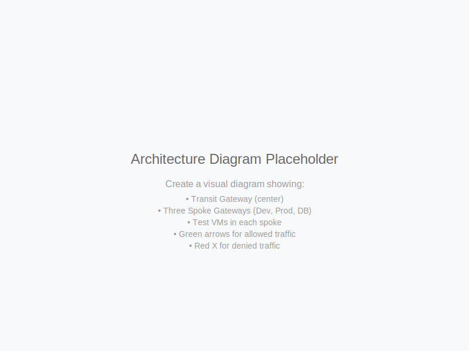

# Prevent Lateral Movement - VM Tags

Deploy **Zero Trust microsegmentation** in 15 minutes using Aviatrix Distributed Cloud Firewall (DCF) and SmartGroups. This blueprint enforces tag-based network segmentation across AWS VPCs — preventing lateral movement, accelerating compliance, and eliminating security group sprawl.

> [!TIP]
> **🤖 Optimized for Claude Code** — Run `/deploy-blueprint prevent-lateral-movement-vm-tags` for AI-guided deployment with prerequisite checks, or `/analyze-blueprint prevent-lateral-movement-vm-tags` for resource and cost details. [Get Claude Code](https://claude.ai/code)

---

## Prerequisites

### Aviatrix Control Plane

| Component | Requirement | Notes |
|-----------|-------------|-------|
| **Aviatrix Controller** | v7.1+ | Must be deployed, accessible, and have your AWS account onboarded under **Accounts > Access Accounts** |
| **Aviatrix CoPilot** | Required | Used for topology visualization, DCF Monitor, and SmartGroup verification during the demo |
| **DCF** | Must be **disabled** | If DCF is already enabled on your Controller with active policies, disable it before running `terraform destroy` — otherwise the destroy will fail. See [Cleanup](#cleanup). |

### Local Tools

| Tool | Version | Installation | Purpose |
|------|---------|--------------|---------|
| **Terraform** | >= 1.5 | [Install Guide](https://developer.hashicorp.com/terraform/install) | Infrastructure provisioning |
| **AWS CLI** | v2 | [Install Guide](https://docs.aws.amazon.com/cli/latest/userguide/getting-started-install.html) | AWS authentication and EC2 Instance Connect |

### AWS IAM Permissions

Two IAM roles must exist in your AWS account **before** deploying. The Aviatrix Controller uses these roles to launch and manage gateways.

| Role | Policies Required | Purpose |
|------|------------------|---------|
| `aviatrix-role-app` | `PowerUserAccess` + `IAMReadOnlyAccess` + custom `AviatrixIAMAccess`* | Controller assumes this role to manage AWS resources |
| `aviatrix-role-ec2` | `AmazonS3ReadOnlyAccess` | Attached to gateway EC2 instances for software updates |

**\*Custom `AviatrixIAMAccess` policy actions required:**
`iam:CreateInstanceProfile`, `iam:DeleteInstanceProfile`, `iam:AddRoleToInstanceProfile`, `iam:RemoveRoleFromInstanceProfile`, `iam:GetInstanceProfile`, `iam:TagInstanceProfile`, `iam:UntagInstanceProfile`, `iam:PassRole`, `iam:GetRole`, `iam:GetRolePolicy`, `iam:ListInstanceProfiles`, `iam:ListRoles`

> **Trust relationships:** `aviatrix-role-app` must trust the AWS account where your Controller runs (`arn:aws:iam::<controller-account-id>:root`). `aviatrix-role-ec2` must trust the EC2 service (`ec2.amazonaws.com`).
>
> If these roles don't exist, see the [Aviatrix onboarding documentation](https://docs.aviatrix.com/documentation/latest/getting-started/onboarding-aws-access-account.html).

### Environment Variables

Set these before running Terraform:

```bash
# Aviatrix Controller credentials
export AVIATRIX_CONTROLLER_IP="<your-controller-ip>"
export AVIATRIX_USERNAME="admin"
export AVIATRIX_PASSWORD="<your-password>"

# AWS credentials (choose one method)
# Option A: Environment variables
export AWS_ACCESS_KEY_ID="<your-access-key>"
export AWS_SECRET_ACCESS_KEY="<your-secret-key>"
export AWS_DEFAULT_REGION="us-east-1"

# Option B: AWS CLI profile
export AWS_PROFILE="<your-profile-name>"
```

### Verify Prerequisites

```bash
# Confirm AWS credentials are active
aws sts get-caller-identity

# Confirm EC2 key pair exists in the target region
aws ec2 describe-key-pairs --region us-east-1 --query 'KeyPairs[].KeyName'

# Confirm sufficient Elastic IP quota (need 4 free EIPs)
aws ec2 describe-account-attributes --attribute-names max-elastic-ips --query 'AccountAttributes[0].AttributeValues[0].AttributeValue'
aws ec2 describe-addresses --query 'Addresses | length(@)'
# Available EIPs = quota - current count. Must be >= 4.
```

Also confirm in the Aviatrix Controller that your AWS account is onboarded under **Accounts > Access Accounts** before proceeding. Gateway creation will time out if the account is not onboarded.

---

## Architecture Overview



> **For a detailed breakdown of every component, how they connect, and what to explain during a customer demo, see [ARCHITECTURE.md](ARCHITECTURE.md).**

This blueprint deploys the following into a single AWS region:

| Component | Count | Description |
|-----------|-------|-------------|
| Aviatrix Transit Gateway | 1 | Central hub connecting all spokes |
| Aviatrix Spoke Gateways | 3 | One each for Dev, Prod, and DB VPCs |
| AWS VPCs | 4 | Transit + Dev + Prod + DB |
| EC2 Test VMs | 3 | One per spoke VPC for connectivity testing |
| EC2 Instance Connect Endpoints | 2 | Secure, keyless SSH tunnel to Dev and Prod VMs — no bastion, no public IP needed |
| DCF SmartGroups | 3 | Tag-based groups: dev, prod, db |
| DCF Policies | 5 | Zero Trust rules — see table below |
| Gatus Dashboard | 1 | Live connectivity dashboard (ALB-exposed, browser accessible) |

**DCF Policies configured:**

| Priority | Policy | Action | What it proves |
|----------|--------|--------|----------------|
| 100 | `allow-prod-to-db` | PERMIT | Legitimate business traffic flows |
| 110 | `allow-dev-to-prod-read-only` | PERMIT (ICMP only) | Protocol-level granularity |
| 200 | `deny-dev-to-db` | DENY | Lateral movement from dev to production data blocked |
| 210 | `deny-prod-to-dev` | DENY | Compromised prod cannot reach dev |
| 1000 | `default-deny-all` | DENY | Zero Trust default — no implicit trust |

---

## Resources Created

| Resource | Quantity | Estimated Cost/Hour |
|----------|----------|---------------------|
| Aviatrix Transit Gateway (t3.small) | 1 | $0.05 |
| Aviatrix Spoke Gateways (t3.small) | 3 | $0.15 |
| EC2 Test VMs (t3.micro) | 3 | $0.03 |
| EC2 Gatus Instance (t3.micro) | 1 | $0.01 |
| Application Load Balancer | 1 | $0.02 |
| Elastic IPs | 4 | $0.02 |
| EC2 Instance Connect Endpoints | 2 | Free |
| VPCs, Subnets, Route Tables, IGWs | Multiple | Free |
| DCF SmartGroups + Policies | 3 + 5 | Free |

**Total: ~$0.28/hour (~$6.70/day)**

> Destroy resources after testing to avoid ongoing charges.

---

## Quickstart

```bash
git clone https://github.com/AviatrixSystems/aviatrix-blueprints.git
cd aviatrix-blueprints/blueprints/prevent-lateral-movement-vm-tags

# Set credentials (see Prerequisites)
export AVIATRIX_CONTROLLER_IP="<your-controller-ip>"
export AVIATRIX_USERNAME="admin"
export AVIATRIX_PASSWORD="<your-password>"
export AWS_PROFILE="<your-profile>"

cp terraform.tfvars.example terraform.tfvars
# Edit terraform.tfvars with your values

terraform init
terraform apply
```

**Total deployment time: ~15 minutes**

---

## Deployment Guide

### Step 1: Clone and Navigate

```bash
git clone https://github.com/AviatrixSystems/aviatrix-blueprints.git
cd aviatrix-blueprints/blueprints/prevent-lateral-movement-vm-tags
```

### Step 2: Configure Variables

```bash
cp terraform.tfvars.example terraform.tfvars
```

Edit `terraform.tfvars` with your values:

```hcl
aws_account_name      = "my-aws-account"  # Must match account name in Controller > Accounts
aws_region            = "us-east-1"
name_prefix           = "zt-seg"
test_vm_key_name      = "my-keypair"      # Must exist in the target region
test_vm_instance_type = "t3.micro"
```

### Step 3: Deploy

```bash
terraform init
terraform plan
terraform apply
```

Type `yes` when prompted. **Deployment takes approximately 10–15 minutes.**

### Step 4: Open the Gatus Live Dashboard

```bash
terraform output gatus_dashboard_url
```

Open the URL in a browser. Wait 3–5 minutes after apply for the Gatus instance to boot and pass ALB health checks. If you see **503**, wait 60 seconds and refresh.

**What you'll see:**

| Tile | Status | What it proves |
|------|--------|----------------|
| Prod → DB (ALLOWED) | 🟢 Healthy | `allow-prod-to-db` policy permitting legitimate traffic |
| Prod → Dev ICMP (BLOCKED) | 🔴 Unhealthy | `deny-prod-to-dev` blocking lateral movement |
| Prod → Dev TCP (BLOCKED) | 🔴 Unhealthy | `default-deny-all` catching everything else |

Dashboard probes update every 10 seconds. Leave it open during the demo — the audience sees live DCF enforcement without any commands.

### Step 5: Verify in CoPilot

1. Log into your Controller and click **CoPilot** in the top navigation
2. **Cloud Fabric > Topology** — verify Transit + 3 Spoke gateways are visible and connected
3. **Security > Distributed Cloud Firewall > SmartGroups** — verify 3 SmartGroups exist with correct VM membership
4. **Security > Distributed Cloud Firewall > Rules** — verify all 5 policies are configured
5. **Security > Distributed Cloud Firewall > Monitor** — use this during test scenarios to see live PERMITTED/DENIED entries

---

## Test Scenarios

### Automated — Gatus Dashboard (from Prod)

| # | Flow | Protocol | Expected | DCF Policy |
|---|------|----------|----------|------------|
| G1 | Prod → DB | ICMP | 🟢 GREEN | `allow-prod-to-db` (priority 100) |
| G2 | Prod → Dev | ICMP | 🔴 RED | `deny-prod-to-dev` (priority 210) |
| G3 | Prod → Dev | TCP:22 | 🔴 RED | `default-deny-all` (priority 1000) |

### Manual — SSH Testing

Connect to any test VM using EC2 Instance Connect (no key file or bastion needed):

```bash
# Get instance IDs
terraform output test_vm_ids

# SSH to any VM
aws ec2-instance-connect ssh --instance-id <instance-id> --region us-east-1
```

| # | Flow | Protocol | Expected | DCF Policy |
|---|------|----------|----------|------------|
| M1 | Dev → DB | ICMP | ❌ BLOCKED | `deny-dev-to-db` (priority 200) |
| M2 | Prod → DB | ICMP | ✅ ALLOWED | `allow-prod-to-db` (priority 100) |
| M3 | Dev → Prod | ICMP | ✅ ALLOWED | `allow-dev-to-prod-read-only` (priority 110) |
| M3 | Dev → Prod | TCP | ❌ BLOCKED | `default-deny-all` (priority 1000) |
| M4 | Prod → Dev | ICMP | ❌ BLOCKED | `deny-prod-to-dev` (priority 210) |

**Run a test:**

```bash
# ICMP test
ping <target-private-ip>

# TCP test (wait up to 10s for timeout — timeout means DCF blocked it)
nc -zv -w 10 <target-private-ip> 22
```

**Policy coverage matrix:**

| Priority | Policy | Gatus | Manual |
|----------|--------|-------|--------|
| 100 | `allow-prod-to-db` | ✅ G1 | ✅ M2 |
| 110 | `allow-dev-to-prod-read-only` | ❌ gap* | ✅ M3 |
| 200 | `deny-dev-to-db` | ❌ gap* | ✅ M1 |
| 210 | `deny-prod-to-dev` | ✅ G2 | ✅ M4 |
| 1000 | `default-deny-all` | ✅ G3 | ✅ M3 |

*Gatus runs in the prod spoke and cannot initiate probes from dev. Policies 110 and 200 require manual SSH testing from the dev VM.

---

## Demo Walkthrough

Use this sequence to tell the Zero Trust story on a customer call (~15 minutes):

### 1. The Problem (2 min)
> *"Traditional security groups create flat networks — once two workloads are connected, everything can talk to everything. 83% of ransomware attacks succeed through lateral movement across unsegmented networks."*

**Show:** CoPilot > Topology — the hub-and-spoke architecture visually separating Dev, Prod, and DB.

### 2. SmartGroups: Automated Zero Trust Boundaries (3 min)
> *"New workloads tagged `Environment=production` instantly inherit Zero Trust policies — no manual security group updates, no tickets, no delay."*

**Show:** Security > DCF > SmartGroups — click into `dev-smartgroup`, show the `Environment=development` selector.

### 3. Zero Trust Policies: Default-Deny + Explicit Allow (3 min)
**Show:** Security > DCF > Rules — walk through the policy list:
- Priority 100 (`allow-prod-to-db`): *"Explicit allow for legitimate business need"*
- Priority 200 (`deny-dev-to-db`): *"Zero Trust blocks dev from production data — prevents lateral movement"*
- Priority 1000 (`default-deny-all`): *"No implicit trust — everything is blocked unless explicitly permitted"*

### 4. Live Testing: Proving it Works (5 min)
**Show the Gatus dashboard** — two red tiles proving lateral movement is blocked in real time.

Then SSH from dev VM and try to ping the DB:
```bash
ping <db-vm-private-ip>  # Times out — DCF blocked it
```

**Show CoPilot > DCF > Monitor** — the DENIED entry appears with source, destination, and policy name.

### 5. Business Value (2 min)
| Outcome | Traditional | Aviatrix Zero Trust |
|---------|-------------|---------------------|
| Deployment time | 2–4 weeks (manual SG rules) | ⚡ 15 minutes |
| Lateral movement | ❌ Flat network | ✅ Blocked |
| Policy management | Manual per-workload | ✅ Tag-based automation |
| Compliance audit trail | VPC Flow Logs (delayed) | ✅ Real-time DCF Monitor |

---

## Cleanup

### ⚠️ Important: DCF Prerequisite for Destroy

`terraform destroy` will attempt to disable DCF on your Controller. If your Controller has **other active DCF policies outside this blueprint**, the Controller will reject the request and destroy will fail.

**Before running `terraform destroy`:**
- If DCF is only used by this blueprint: proceed normally
- If DCF is shared with other policies: manually remove or disable those policies first, then destroy

### Destroy

```bash
terraform destroy
```

Type `yes` when prompted. **Destroy takes approximately 8–10 minutes.**

### Manual Cleanup (if destroy fails)

Delete resources in this order:

1. **DCF Policies** — CoPilot: Security > DCF > Rules > delete all policies
2. **SmartGroups** — CoPilot: Security > DCF > SmartGroups > delete all groups
3. **Spoke Gateways** — CoPilot: Cloud Fabric > Gateways > delete each spoke
4. **Transit Gateway** — CoPilot: Cloud Fabric > Gateways > delete transit
5. **EC2 Instances** — AWS Console: EC2 > Instances > terminate all VMs
6. **VPCs** — AWS Console: VPC > Your VPCs > delete all VPCs

### Verify Cleanup

```bash
# Check for remaining VPCs
aws ec2 describe-vpcs \
  --filters "Name=tag:Blueprint,Values=prevent-lateral-movement-vm-tags" \
  --query 'Vpcs[].VpcId'

# Check for remaining instances
aws ec2 describe-instances \
  --filters "Name=tag:Blueprint,Values=prevent-lateral-movement-vm-tags" \
  --query 'Reservations[].Instances[].InstanceId'
```

Both commands should return `[]`.

---

## Troubleshooting

**Gateway creation times out**
- Verify AWS account is onboarded in the Controller under **Accounts > Access Accounts**
- Confirm `aviatrix-role-app` and `aviatrix-role-ec2` IAM roles exist in your AWS account
- Check sufficient EIP quota (need 4 free EIPs): `aws ec2 describe-addresses --query 'Addresses | length(@)'`

**DCF policies not enforcing**
- Verify DCF is enabled: Controller > Security > DCF > Configuration
- Check SmartGroup membership: Security > DCF > SmartGroups > click group > confirm VMs are listed
- Ensure test VMs have the correct `Environment` tag (verify in EC2 console)
- Wait 1–2 minutes for policy changes to propagate

**Gatus dashboard shows 503**
- ALB health check hasn't passed yet — wait 60 seconds and refresh
- The Gatus EC2 instance needs ~3–5 minutes to boot, pull Docker image, and start the container

**`terraform destroy` fails with DCF error**
- Your Controller has active DCF policies outside this blueprint
- Disable or remove those policies in CoPilot before retrying destroy

**Can't SSH to test VMs**
- Use EC2 Instance Connect: `aws ec2-instance-connect ssh --instance-id <id> --region us-east-1`
- Confirm the EICE endpoint is deployed (it is by default for dev and prod VMs)
- DB VM has no EICE — use SSM instead: `aws ssm start-session --target <instance-id>`

---

## Tested With

| Component | Version |
|-----------|---------|
| Aviatrix Controller | 7.2.x |
| Aviatrix Terraform Provider | 8.2.x |
| Terraform | 1.9.x |
| AWS Provider | 6.32.x |

> Provider version must match your Controller version. See the [full compatibility matrix](https://registry.terraform.io/providers/AviatrixSystems/aviatrix/latest/docs/guides/release-compatibility).

---

## Contributing

See the [Contributing Guide](../../CONTRIBUTING.md).

## License

Apache 2.0 — see [LICENSE](../../LICENSE).
